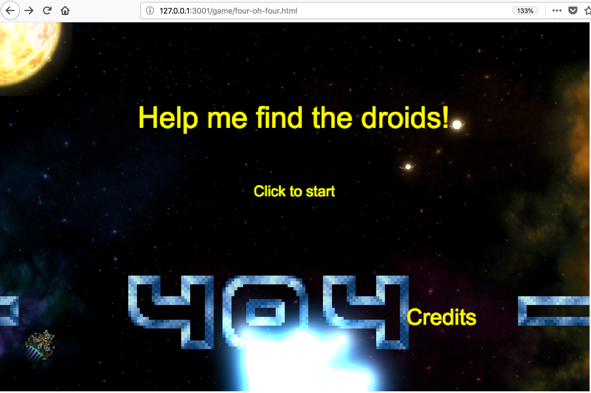
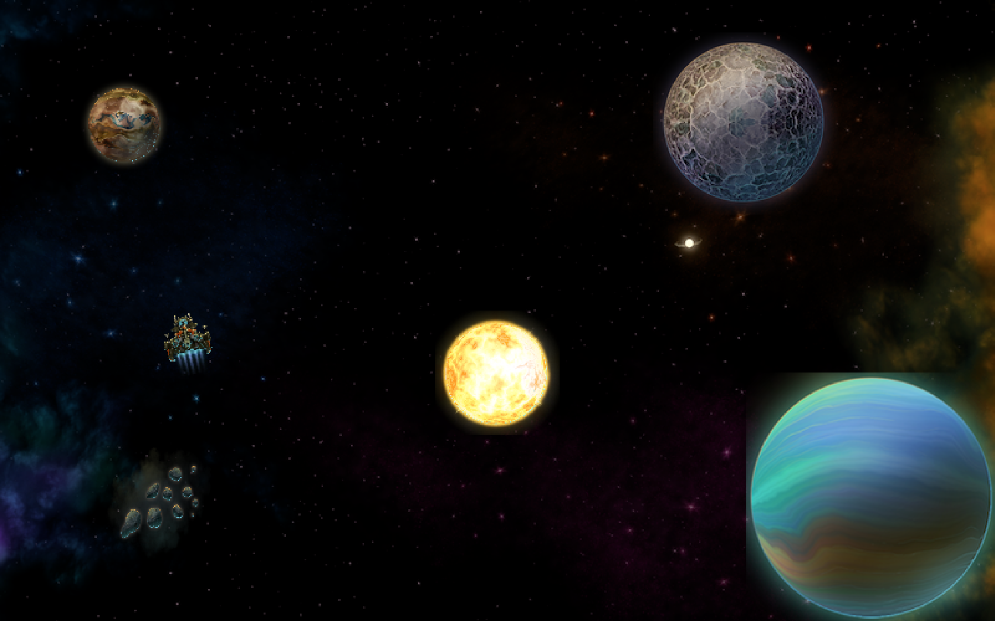

# Four-Oh-Four

Small mini-game made during Teamwork's 2018 Spring Hackathon.
The idea was to create a fun, interactive 404 not found page while learning to make games using [Phaser 3 game engine](https://phaser.io/)

Graphics: thanks to [Ram Zorkot](https://opengameart.org/users/tatermand) for making these available. 

## Use

- clone this repo
- install node.js
- `make server` will start the game
- `make init` will start Node's http-server

